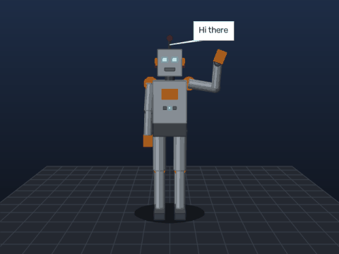
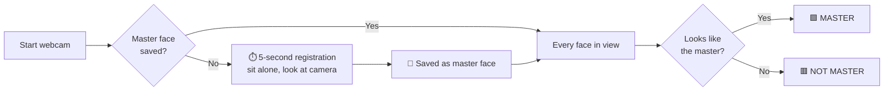
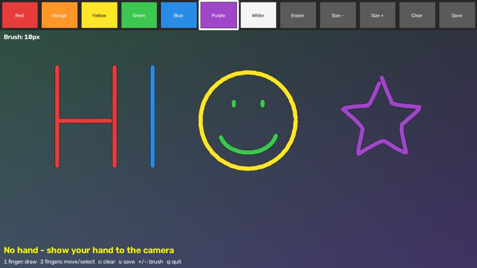
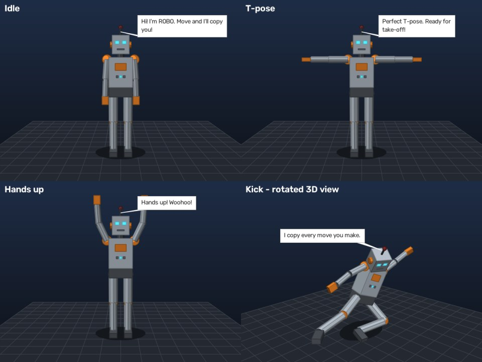
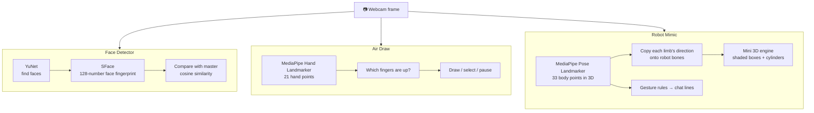

<div align="center">

# 🤖 OpenCV + MediaPipe Playground

**Three webcam apps in one project: a face detector that knows *you*, a finger-painting canvas, and a 3D robot that copies your moves and talks back.**




[Quick start](#-quick-start-5-minutes) •
[Features](#-features) •
[Step-by-step setup](#-step-by-step-setup) •
[How to use each app](#-how-to-use-each-app) •
[Troubleshooting](#-troubleshooting) •
[How it works](#-how-it-works)

</div>

---

## ✨ Features

| | App | What it does |
|---|---|---|
| 🧑 | **Face Detector** | Registers **your** face in the first 5 seconds as the **MASTER** face. From then on you get a 🟩 green `MASTER` box and everyone else gets a 🟥 red `NOT MASTER` box. Works on the webcam, photos and video files. |
| ✍️ | **Air Draw** | Tracks your hand and lets you **paint in the air with your index finger**. Pick colours, an eraser and brush sizes from an on-screen toolbar just by pointing. Save your art as an image. |
| 🦾 | **Robot Mimic** | A **3D robot copies your whole body in real time**. It also **chats with you**: wave, raise your hands, do a T-pose, clap or squat and it reacts in a speech bubble. Drag with the mouse to spin the 3D view. |

**Also:**
- ⚡ Runs on a normal laptop CPU. No GPU, no account, no internet needed after setup.
- 🖱️ One-click setup and start on Windows (`setup_windows.bat` → `run_windows.bat`).
- 📋 A simple menu to pick the app, so there are no commands to remember.
- 🔒 Your face data stays on your computer and is never uploaded.

---

## 🚀 Quick start (5 minutes)

> Already have Python 3.10+ installed? Then this is all you need.

**Windows**
1. [**Download the ZIP**](https://github.com/vikas-meu/face_detector_pratiksha/archive/refs/heads/main.zip) and extract it.
2. Double-click **`setup_windows.bat`** and wait for *"Setup complete!"*.
3. Double-click **`run_windows.bat`**, type `1`, `2` or `3`, and press Enter.

**macOS / Linux**
```bash
git clone https://github.com/vikas-meu/face_detector_pratiksha.git
cd face_detector_pratiksha
bash setup_mac_linux.sh
source venv/bin/activate
python main.py
```

You'll see this menu:

```
============================================================
   OpenCV + MediaPipe Playground
============================================================
   1. Face Detector  - registers your face as MASTER, everyone else is NOT MASTER
   2. Air Draw       - paint on the screen with your index finger
   3. Robot Mimic    - a 3D robot copies your body and chats with you
   q. Quit
============================================================
Choose an app (1-3) and press Enter:
```

New to Python? Follow the full guide below. 👇

---

## 📦 Step-by-step setup

### What you need

| | Requirement |
|---|---|
| 💻 | Windows 10/11, macOS on Apple Silicon (M1/M2/M3/M4), or 64-bit Linux |
| 🐍 | Python **3.10 or newer** (tested on 3.11 and 3.13) |
| 📷 | A webcam (built-in or USB) |
| 🌐 | Internet for the one-time setup. Needs about 400 MB of disk space, including the models. |

### Step 1: Install Python

<details>
<summary><b>🪟 Windows</b> (click to expand)</summary>

1. Go to <https://www.python.org/downloads/> and download **Python 3.12** (or 3.11).
2. Run the installer.
3. ⚠️ **Important:** on the first screen, tick **"Add python.exe to PATH"**, then click **Install Now**.
4. Check it worked: press `Win`, type `cmd`, press Enter, and run:
   ```
   python --version
   ```
   You should see something like `Python 3.12.x`.

</details>

<details>
<summary><b>🍎 macOS</b> (click to expand)</summary>

1. Download the macOS installer from <https://www.python.org/downloads/> and run it.
2. Open **Terminal** (`Cmd + Space`, type *Terminal*) and check:
   ```bash
   python3 --version
   ```

> ⚠️ MediaPipe only supports **Apple Silicon** Macs. On an older Intel Mac, skip the setup script and run
> `pip install opencv-contrib-python` instead. Then `python face_detector.py` works, but Air Draw and Robot Mimic won't.

</details>

<details>
<summary><b>🐧 Linux (Ubuntu/Debian)</b> (click to expand)</summary>

```bash
sudo apt update
sudo apt install python3 python3-venv python3-pip libgl1 libglib2.0-0
```

</details>

### Step 2: Download the project

<details open>
<summary><b>Option A: ZIP download (easiest, no Git needed)</b></summary>

1. Click [**Download ZIP**](https://github.com/vikas-meu/face_detector_pratiksha/archive/refs/heads/main.zip), or on the GitHub page click the green **`<> Code`** button and then **Download ZIP**.
2. Right-click the ZIP and choose **Extract All…** (Windows), or double-click it (macOS).
3. Open the extracted folder **`face_detector_pratiksha-main`**.

</details>

<details>
<summary><b>Option B: with Git</b></summary>

```bash
git clone https://github.com/vikas-meu/face_detector_pratiksha.git
cd face_detector_pratiksha
```

</details>

### Step 3: Install everything (one time only)

<details open>
<summary><b>🪟 Windows: one click</b></summary>

1. Double-click **`setup_windows.bat`**.
2. Wait until you see **"Setup complete!"** (about 2–5 minutes).

> If Windows shows *"Windows protected your PC"*, click **More info**, then **Run anyway**.

</details>

<details>
<summary><b>🪟 Windows: manual commands</b></summary>

Open Command Prompt in the project folder (in File Explorer, click the address bar, type `cmd`, and press Enter):
```bat
python -m venv venv
venv\Scripts\activate
pip install -r requirements.txt
python main.py --download-models
```

</details>

<details>
<summary><b>🍎 macOS / 🐧 Linux</b></summary>

Open a terminal in the project folder:
```bash
bash setup_mac_linux.sh
```
Or by hand:
```bash
python3 -m venv venv
source venv/bin/activate
pip install -r requirements.txt
python main.py --download-models
```

</details>

> 💡 **What is `venv`?** It's a private folder holding this project's packages, so nothing else on your computer is affected. To uninstall, just delete the project folder.

### Step 4: Start the apps

| | Windows | macOS / Linux |
|---|---|---|
| Open the menu | Double-click **`run_windows.bat`** | `source venv/bin/activate` then `python main.py` |
| Jump straight to an app | `run_windows.bat 3` | `python main.py 3` |

When you close an app, you come back to the menu.

---

## 🎮 How to use each app

### 1️⃣ Face Detector with master face



1. Start it (menu option **1**). A yellow banner says **`REGISTERING MASTER FACE 5.0s`**.
2. **Sit alone** in front of the camera and look at it. Turn your head a little so it learns a few angles.
3. After 5 seconds you'll see **"Master face registered!"**, and your face appears in the top-right corner.
4. Ask someone else to step in. They get a **red NOT MASTER** box, and you stay **green MASTER**.

The master face is saved, so next time it goes straight to recognition.

| Key | Action |
|---|---|
| `r` | Register a new master face |
| `s` | Save a snapshot to `output/` |
| `q` / `Esc` | Quit |

<details>
<summary><b>More options: photos, videos, strictness</b></summary>

Run these with the venv active, from the project folder:

```bash
python face_detector.py --image group.jpg     # check a photo (result saved to output/)
python face_detector.py --video clip.mp4      # check a video file
python face_detector.py --register            # force a new 5-second registration
python face_detector.py --camera 1            # use a second / USB webcam
python face_detector.py --threshold 0.45      # stricter: fewer false MASTER matches
```

The number on each label (for example `MASTER 0.72`) is how similar that face is to the master face. Anything at or above **0.363** counts as the master.

</details>

---

### 2️⃣ Air Draw



<sub>Air Draw interface with a drawing made using the toolbar colours. In the real app your camera picture is behind the drawing.</sub>

| ✋ Gesture | What happens |
|---|---|
| ☝️ **Index finger up** | **Draw** |
| ✌️ **Index + middle finger up** | **Move** without drawing. Point at the top bar to pick a colour or tool. |
| ✊ **Fist** / hand out of view | Pause |

**Toolbar:** 🔴 🟠 🟡 🟢 🔵 🟣 ⚪ colours · **Eraser** · **Size −/+** · **Clear** · **Save**

| Key | Action |
|---|---|
| `c` | Clear the drawing |
| `s` | Save the drawing to `output/` |
| `+` / `-` | Bigger / smaller brush |
| `q` / `Esc` | Quit |

> 💡 **Tips:** use good lighting, keep your palm facing the camera, and move at a steady speed for smooth lines.

---

### 3️⃣ Robot Mimic with a chatting 3D robot



<sub>Real output of the robot renderer. The kick was copied from a detected human pose and is shown from a rotated 3D view.</sub>

1. Start it (menu option **3**). On the left you see yourself with a tracked skeleton, and on the right is **ROBO**.
2. **Step back** so the camera sees as much of your body as possible. Upper body only works too, and the robot's legs then stand still.
3. Move! ROBO copies your arms, legs, body lean and head turns, like a mirror.
4. Try these to chat with ROBO:

| You do… | ROBO says something like… |
|---|---|
| 👋 Wave | *"Hi there! \*waves back\*"* |
| 🙌 Both hands up | *"Hands up! Woohoo!"* |
| ✈️ T-pose | *"Perfect T-pose. Ready for take-off!"* |
| 👏 Hands together | *"Clap clap! Thank you, thank you."* |
| 🏋️ Squat | *"Nice squat! My knees are hydraulic."* |
| 🙋 One hand up | *"Yes? You have a question?"* |
| ↗️ Lean sideways | *"Whoa, careful, don't fall over!"* |
| 🚶 Leave the camera | *"Hello? Where did you go?"* |

| Mouse / key | Action |
|---|---|
| 🖱️ Drag on the robot | Rotate the 3D view |
| `a` / `d` | Rotate left / right |
| `v` | Reset the view |
| `s` | Save a snapshot to `output/` |
| `q` / `Esc` | Quit |

---

## 🛠️ Troubleshooting

<details>
<summary><b><code>'python' is not recognized as an internal or external command</code></b></summary>

Python isn't on your PATH. Re-run the Python installer, choose **Modify**, and tick **"Add Python to environment variables"**. Or reinstall and tick **"Add python.exe to PATH"**. You can also try `py` instead of `python`.

</details>

<details>
<summary><b><code>No module named 'cv2'</code> or <code>No module named 'mediapipe'</code></b></summary>

The virtual environment isn't active, or setup didn't finish. Run setup again, or:
```bash
venv\Scripts\activate          # Windows
source venv/bin/activate       # macOS / Linux
pip install -r requirements.txt
```

</details>

<details>
<summary><b><code>Could not open webcam #0</code></b></summary>

- Close other apps using the camera (Zoom, Teams, Discord, browser tabs).
- Try the other camera: `python main.py 1 --camera 1`.
- **Windows:** Settings → Privacy & security → Camera → allow **desktop apps**.
- **macOS:** System Settings → Privacy & Security → Camera → allow **Terminal**.

</details>

<details>
<summary><b><code>Download failed</code> during setup</b></summary>

Check your internet connection and run setup again. If it still fails, the error message prints a link for each model. Download the files yourself and put them in a folder named `models` inside the project.

</details>

<details>
<summary><b>Face Detector: my own face shows NOT MASTER, or someone else shows MASTER</b></summary>

- Press `r` and register again in **good, even lighting**, facing the camera.
- Your own face shows NOT MASTER → loosen the match: `--threshold 0.30`.
- Someone else shows MASTER → make it stricter: `--threshold 0.45`.

</details>

<details>
<summary><b>Air Draw: lines are shaky, or it draws when I don't want it to</b></summary>

- Improve the lighting and keep your whole hand in view.
- Hold your other fingers clearly **folded** when drawing with one finger.
- Use **two fingers** whenever you want to move without drawing.

</details>

<details>
<summary><b>Robot Mimic: the robot's legs don't move</b></summary>

The camera has to see your legs. Step further back until your knees and feet are in the picture. If only your upper body is visible, ROBO stands still from the waist down. That's on purpose.

</details>

<details>
<summary><b>It's slow / low FPS</b></summary>

Close other heavy programs, and plug in your laptop (battery saver slows the CPU). The apps use the CPU only. 15–30 FPS is normal on an average laptop.

</details>

<details>
<summary><b>Linux: the window doesn't open, or there's a Qt / libGL error</b></summary>

```bash
sudo apt install libgl1 libglib2.0-0
```

</details>

---

## 🧠 How it works



<details>
<summary><b>Face Detector in detail</b></summary>

1. **YuNet**, OpenCV's face detection model, finds every face plus 5 landmarks (eyes, nose, mouth corners).
2. Each face is aligned and passed to **SFace**, OpenCV's face recognition model, which turns it into 128 numbers.
3. During registration, the fingerprints from every frame (plus mirrored copies) are averaged into one **master fingerprint**.
4. Each new face is compared with it using cosine similarity. At or above `0.363` it's the **MASTER**, otherwise it's **NOT MASTER**.

</details>

<details>
<summary><b>Air Draw in detail</b></summary>

1. **MediaPipe Hand Landmarker** finds 21 points on your hand in every frame.
2. A finger counts as "up" when its tip is clearly further from the wrist than its middle joint. This works at any hand angle.
3. The fingertip position is smoothed to remove jitter. Lines are drawn on a separate transparent canvas that is laid over the camera picture.

</details>

<details>
<summary><b>Robot Mimic in detail</b></summary>

1. **MediaPipe Pose Landmarker** gives 33 body points **in 3D metres**, centred on your hips.
2. The robot has its own fixed bone lengths, so it keeps its proportions whatever your size. For each bone, the code copies the direction of the matching body part (upper arm, forearm, thigh…) from you.
3. The robot is built from boxes, cylinders and spheres and drawn by a tiny 3D engine (`Renderer` in `robot_mimic.py`). It projects, shades and sorts every face back-to-front, using only NumPy and OpenCV. No game engine is needed.
4. Simple rules on your pose (wrist above head, both arms level, knee angle…) pick what ROBO says, with a typing effect.

</details>

---

## 📁 Project structure

```
face_detector_pratiksha/
├── main.py              ← app menu (start here)
├── face_detector.py     ← 1. face detector with master face
├── air_draw.py          ← 2. finger painting
├── robot_mimic.py       ← 3. 3D robot that copies you and chats
├── common.py            ← shared helpers (webcam, model downloads, saving)
├── requirements.txt     ← Python packages
├── setup_windows.bat    ← one-click setup (Windows)
├── run_windows.bat      ← one-click start (Windows)
├── setup_mac_linux.sh   ← setup (macOS / Linux)
└── docs/images/         ← pictures used in this README

Created automatically (not uploaded to GitHub):
├── venv/                ← installed packages
├── models/              ← downloaded AI models (~54 MB)
├── master/              ← your registered master face (private!)
└── output/              ← your snapshots and drawings
```

---

## 🔒 Privacy

- Everything runs **on your computer**. No video or image is ever sent anywhere.
- Your master face is stored only in the `master/` folder (`master_face.jpg` and `master_features.npy`). It is excluded from Git, so it never gets uploaded.
- To make the app forget you, delete the `master/` folder or press `r` to register someone new.

---

## 🙏 Credits

- [OpenCV](https://opencv.org/), with the [YuNet](https://github.com/opencv/opencv_zoo/tree/main/models/face_detection_yunet) and [SFace](https://github.com/opencv/opencv_zoo/tree/main/models/face_recognition_sface) models from the OpenCV Model Zoo
- [Google MediaPipe](https://ai.google.dev/edge/mediapipe/solutions/guide): the Hand Landmarker and Pose Landmarker models

<div align="center">

**Have fun! If you like it, give the repo a ⭐**

</div>
